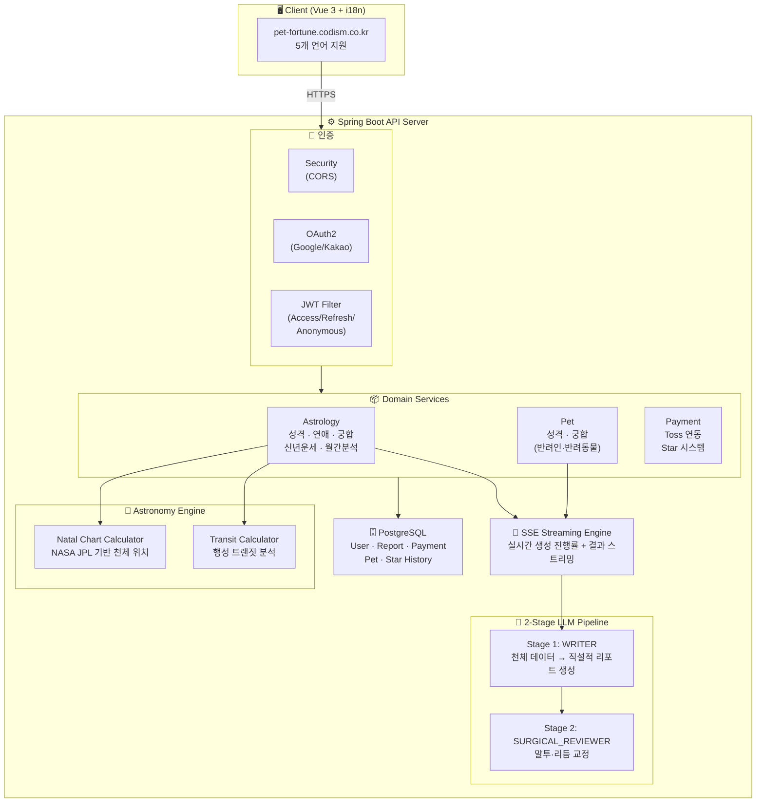

<p align="center">
  
</p>

<p align="center">NASA JPL 천체 데이터 + AI 기반 별자리 분석 & 반려동물 운세 플랫폼</p>

<p align="center">
  <a href="https://pet-fortune.codism.co.kr">
    
  </a>
</p>

<br>

## 📌 프로젝트 소개

**꼬순내 신당**은 천체 위치 계산(NASA JPL Ephemeris)과 2단계 LLM 파이프라인을 활용하여, 깊이 있는 별자리 성격 분석 리포트를 생성하는 AI 콘텐츠 플랫폼입니다.

출생 시간/장소 기반 네이탈 차트 분석, 행성 트랜짓 기반 신년 운세·월간 분석, 3가지 유형의 궁합 분석(연애·우정·비즈니스), 반려동물 성격·궁합 분석까지 다양한 콘텐츠를 **5개 언어**(한국어·영어·일본어·중국어 간체/번체)로 SSE 스트리밍 실시간 제공합니다.

> **테스트 계정**
> - ID: `test@codism.com`
> - PW: `testq1w2e3r4!!`

<br>

## 🏗️ 시스템 아키텍처



<br>

## 🛠️ 기술 스택

| 구분 | 기술 |
|------|------|
| **Frontend** | Vue 3.5, Vite, Vue Router 4, Vue-i18n (5개 언어), Axios, Chart.js, Composition API |
| **Backend** | Spring Boot 3.2, Java 17, Spring Security, JPA/Hibernate, QueryDSL |
| **Database** | PostgreSQL |
| **AI/LLM** | OpenAI GPT-5.1 / GPT-5-mini, 2-Stage Prompt Pipeline, 60개 프롬프트 (12종 × 5개 언어) |
| **천체 계산** | Astronomy Engine (NASA JPL Ephemeris) — 나탈 차트 + 트랜짓 분석 |
| **인증** | OAuth2 (Google, Kakao), JWT (Access/Refresh/Anonymous Token) |
| **결제** | Toss Payments (토스페이먼츠) |
| **실시간** | SSE (Server-Sent Events) |
| **API 코드 생성** | Orval (OpenAPI spec → TypeScript API 클라이언트 자동 생성) |
| **배포** | Docker, Nginx |
| **API 문서** | Scalar (SpringDoc OpenAPI 3.0 기반 인터랙티브 API 문서) |

<br>

## ✨ 주요 기능

### 1. 별자리 성격 분석 리포트 (10개 섹션)
출생 시간/장소 기반으로 네이탈 차트를 계산하고, 태양/달/상승/수성/금성/화성 + 12하우스 배치를 분석하여 10개 섹션의 성격 리포트를 생성합니다.

| 섹션 | 참조 행성 | 설명 |
|------|----------|------|
| 중심축 | 태양 | 인생의 핵심 욕구, 방향 |
| 혼자 있을 때 | 달 | 내면의 감정 패턴 |
| 의사결정 & 가치관 | 수성 + 금성 | 판단 방식, 가치 기준 |
| 스트레스 반응 | 달 + 화성 | 감정 트리거와 반응 |
| 인간관계 | 금성 + 7하우스 | 반복되는 관계 패턴 |
| 연애 | 금성 + 화성 | 사랑 방식과 욕망 |
| 커리어 | 토성 + 10하우스 | 일 처리 방식, 진로 |
| 강점 | 태양 + 목성 | 핵심 무기 |
| 약점 | 토성 | 반복되는 함정 |
| 조언 | 종합 | 인생 설계 방향 |

### 2. 별자리 궁합 분석 (3가지 유형)
두 사람의 나탈 차트를 비교하고 행성 트랜짓을 분석하여 궁합 리포트를 생성합니다.

| 유형 | 분석 초점 | 입력 |
|------|----------|------|
| 💕 연인 궁합 | 감정·소통·갈등·장기전망 | 공통 연애 상태 |
| 🤝 친구 궁합 | 기질·감정·시너지·전망 | 개별 연애 상태 + 직업 상태 |
| 💼 비즈니스 궁합 | 업무스타일·소통·의사결정·갈등 | 공통 직업 상태 + 직장 내 관계(동료/상사/부하) |

### 3. 신년 운세 & 이번달 종합 분석
행성 트랜짓(Transit) 데이터를 분석하여 시기별 운세를 제공합니다.

| 기능 | 설명 |
|------|------|
| **신년 운세** | 1~12월 월별 운세 + 도메인별 점수(연애·커리어·건강·학업·대인·영적·라이프) |
| **이번달 종합 분석** | 7개 영역 분석 + 중요한 날짜 3개 |

### 4. 2단계 LLM 파이프라인
역할이 분리된 2단계 파이프라인으로 품질을 관리합니다.

```
[천체 데이터 + 트랜짓] → WRITER (GPT-5.1) → [초안] → SURGICAL_REVIEWER (GPT-5.1) → [최종 리포트]
                           (분석+글쓰기)              (말투·리듬 교정)
```

- **WRITER**: 나탈 차트 + 트랜짓 데이터를 직설적 한국어(또는 해당 언어)로 변환. 행성별 가중치 적용
- **SURGICAL_REVIEWER**: 말투, 리듬, 모순을 교정. 원문 최소 수정 원칙

### 5. SSE 실시간 스트리밍
LLM 생성 과정을 SSE로 실시간 전달하여, 사용자가 리포트 생성 진행 상황을 확인할 수 있습니다.

```
Client ←──SSE──── Server
  │                  │
  │  [progress: 10%] │ ← 나탈 차트 계산 완료
  │  [progress: 35%] │ ← 트랜짓 분석 완료
  │  [progress: 55%] │ ← WRITER 생성 중
  │  [progress: 80%] │ ← REVIEWER 교정 중
  │  [progress: 100%]│ ← 최종 리포트
  │  [complete]       │
```

### 6. 천체 위치 계산 (Natal Chart + Transit)
Astronomy Engine(NASA JPL Ephemeris)을 사용하여 정확한 천체 위치를 계산합니다.

**나탈 차트 계산:**
- 태양, 달, 수성, 금성, 화성, 목성, 토성의 황도 좌표 계산
- 출생 장소(위도/경도) 기반 상승궁(ASC) 계산
- 12하우스 배치 결정 / 행성 간 각도(Aspect) 분석

**트랜짓 분석:**
- 현재 행성 위치와 나탈 행성 간의 관계 분석
- 어스펙트 강도 계산 / 월별 핵심 시기 도출
- 도메인별 운세 점수 산출 (DomainScoreCalculator)

### 7. 반려동물 콘텐츠
- **반려동물 별자리 성격 분석**: 생년월일 기반 성격 분석
- **궁합 분석**: 반려동물-보호자, 반려동물-반려동물 궁합

### 8. 다국어 지원 (5개 언어)
| 언어 | 코드 | 프롬프트 |
|------|------|---------|
| 한국어 | ko | 12개 |
| English | en | 12개 |
| 日本語 | ja | 12개 |
| 简体中文 | zh | 12개 |
| 繁體中文 | zh-TW | 12개 |

- 브라우저 로케일 자동 감지 + 수동 전환
- 프론트엔드 i18n + 백엔드 프롬프트 모두 로케일별 분리

### 9. 인증 & 결제
- **OAuth2 소셜 로그인**: Google, Kakao
- **JWT 토큰 체계**: Access(1H) / Refresh(7D) / Anonymous(24H) 3종 토큰
- **Toss Payments 연동**: 별(Star) 충전 패키지 결제
- **별 경제 시스템**: 콘텐츠 유형별 차등 과금 (1~2 Star)

<br>

## 🔧 기술적 도전 & 해결

### SSE 스레드에서 SecurityContext 유실
**문제**: SSE는 별도 스레드(sseTaskExecutor)에서 실행되어, ThreadLocal 기반 Spring Security의 SecurityContext가 전파되지 않음 → userId를 가져올 수 없어 별 차감/기록 저장 실패

**해결**: Controller(메인 스레드)에서 userId를 먼저 추출하여 Request DTO에 설정한 뒤 SSE 스레드에 전달
```java
@GetMapping(value = "/report/stream", produces = MediaType.TEXT_EVENT_STREAM_VALUE)
public SseEmitter generateReportStream(@Valid AstrologyRequest request) {
    SecurityUtil.getCurrentUserId().ifPresent(request::setUserId);
    return sseService.streamWithCallback(callback ->
        astrologyReportService.generateReportWithProgress(request, callback));
}
```

### LLM 출력 품질 제어 (태양/달/상승 가중치 불균형)
**문제**: 달+상승이 같은 별자리일 때 해당 별자리 특성이 과대평가되고, 태양이 축소됨

**해결**: 프롬프트에 가중치 균형 규칙을 명시하고, 2단계 파이프라인의 REVIEWER가 교차 검증
```
태양 = 50% (인생 방향, 핵심 판단 기준)
달   = 30% (감정 반응, 내면 패턴)
상승 = 20% (첫인상, 외피)
```

### 다국어 프롬프트 품질 일관성
**문제**: 5개 언어 × 12종 프롬프트(60개)에서 해석 규칙, 톤, 구조가 언어마다 달라질 수 있음

**해결**: 한국어 프롬프트를 마스터로 유지하고, 동일한 분석 규칙(행성 가중치, 원소별 해석 범위, 갈등 패턴 결정 규칙)을 모든 언어에 동기화. 각 언어별 톤/문체만 로컬라이제이션

### 궁합 분석의 관계 맥락 반영
**문제**: 비즈니스 궁합에서 동료/상사-부하 등 관계 유형에 따라 분석 프레임이 달라져야 하지만, LLM이 모든 관계를 동일하게 해석

**해결**: `businessRelation` 필드를 도입하여 직장 내 관계(동료/상사/부하)를 프롬프트에 전달. 관계 유형별 해석 가이드(수평 협업 vs 상하 관계 프레임)를 프롬프트에 명시. 모순 입력(둘 다 상사 등) 시 중립 프레임으로 폴백

### API 스펙 기반 프론트-백 동기화
**문제**: 백엔드 API가 변경될 때마다 프론트엔드의 타입 정의와 API 호출 코드를 수동으로 맞춰야 해서 불일치 발생

**해결**: SpringDoc OpenAPI로 API 스펙을 자동 생성하고, Orval로 OpenAPI spec → TypeScript API 클라이언트를 자동 생성. 백엔드 DTO 변경 시 `orval` 재실행만으로 프론트엔드 타입/API 코드가 동기화. Scalar를 통해 인터랙티브 API 문서도 함께 제공

### 리포트 공유 시스템
**문제**: 인증 없이도 리포트를 공유할 수 있어야 함

**해결**: UUID 기반 shareId를 생성하여, 인증 없이 `/report/{shareId}`로 접근 가능하도록 구현

<br>

## 📊 ERD (주요 엔티티)

```
┌──────────────┐     ┌──────────────────┐     ┌─────────────────┐
│     User     │     │   UserProfile    │     │       Pet       │
├──────────────┤     ├──────────────────┤     ├─────────────────┤
│ id           │──┐  │ id               │     │ id              │
│ email        │  ├──│ user_id (FK)     │  ┌──│ user_id (FK)    │
│ nickname     │  │  │ name             │  │  │ name            │
│ stars        │  │  │ birth_date       │  │  │ birth_date      │
│ provider     │  │  │ birth_time       │  │  │ gender          │
│ provider_id  │  │  │ gender           │  │  │ pet_type        │
└──────────────┘  │  │ is_default       │  │  └─────────────────┘
                  │  └──────────────────┘  │
                  │                        │
    ┌─────────────┴───────┐    ┌───────────┴──────────────┐
    │  AstrologyReport    │    │  AstrologyCompatibility   │
    ├─────────────────────┤    ├──────────────────────────┤
    │ id                  │    │ id                       │
    │ user_id (FK)        │    │ user_id (FK)             │
    │ share_id (UUID)     │    │ share_id (UUID)          │
    │ sun/moon/rising     │    │ relationship_type        │
    │ sections (JSON)     │    │ person1/person2 info     │
    │ llm_stats           │    │ compatibility (JSON)     │
    └─────────────────────┘    └──────────────────────────┘

    ┌─────────────────────┐    ┌──────────────────────────┐
    │  AnnualFortune      │    │  MonthlyAnalysis         │
    ├─────────────────────┤    ├──────────────────────────┤
    │ id                  │    │ id                       │
    │ user_id (FK)        │    │ user_id (FK)             │
    │ share_id (UUID)     │    │ share_id (UUID)          │
    │ year                │    │ year_month               │
    │ monthly_forecasts   │    │ sections (JSON)          │
    │ domain_scores       │    │ important_dates          │
    └─────────────────────┘    └──────────────────────────┘

    ┌─────────────────────┐    ┌──────────────────────────┐
    │  PetAstrologyReport │    │  PetCompatibility        │
    ├─────────────────────┤    ├──────────────────────────┤
    │ id                  │    │ id (Owner/Pet-Pet)       │
    │ user_id (FK)        │    │ user_id (FK)             │
    │ share_id (UUID)     │    │ share_id (UUID)          │
    │ sun/moon/rising     │    │ compatibility (JSON)     │
    └─────────────────────┘    └──────────────────────────┘

    ┌─────────────────────┐    ┌──────────────────────────┐
    │      Payment        │    │      StarHistory         │
    ├─────────────────────┤    ├──────────────────────────┤
    │ id                  │    │ id                       │
    │ user_id (FK)        │    │ user_id (FK)             │
    │ order_id            │    │ amount                   │
    │ payment_key         │    │ type (USE/CHARGE)        │
    │ amount              │    │ fortune_type             │
    │ status              │    │ created_at               │
    └─────────────────────┘    └──────────────────────────┘
```

<br>

## 👥 Team

| 구성원 | GitHub | 역할 |
|------|------|--------|
| 배소연 | [@thdus12](https://github.com/thdus12)| 프론트엔드, 백엔드, 디자인, 기획, 프롬프트 엔지니어 |
| 주재범 | [@jaebum7396](https://github.com/jaebum7396) | 프론트엔드, 백엔드, 인프라 |

<br>

## 📁 프로젝트 구조

```
pet-fortune/                    # Frontend (Vue 3)
├── src/
│   ├── views/                  # 27개 페이지
│   │   ├── astrology/          #   별자리 성향, 연애, 궁합, 신년운세, 월간분석
│   │   ├── pet/                #   반려동물 성향, 궁합
│   │   ├── auth/               #   로그인, 회원가입, OAuth
│   │   ├── mypage/             #   마이페이지, 운세 기록
│   │   └── payment/            #   결제 결과
│   ├── components/             # 23개 컴포넌트
│   │   ├── input/              #   DateSelector, RegionSelector, StatusSelector, TimeSelector
│   │   ├── ui/                 #   CustomDropdown, CustomAlert, LoadingOverlay, Toast
│   │   ├── payment/            #   StarChargeModal, StarConfirmModal
│   │   └── layout/             #   Header, Footer, Sidebar
│   ├── i18n/locales/           # 5개 언어 번역 파일 (ko, en, ja, zh, zh-TW)
│   ├── api/sse/                # SSE 스트리밍 API 클라이언트
│   ├── assets/js/
│   │   ├── api/                # 9개 API 모듈
│   │   └── composables/        # 7개 Composable (useAuth, useStars, usePayment 등)
│   └── router/                 # Vue Router (코드 스플리팅)

pet-fortune-api/                # Backend (Spring Boot)
├── src/main/java/com/petfortune/
│   ├── controller/
│   │   ├── fo/                 # Frontend API (14개 컨트롤러)
│   │   └── bo/                 # Admin API (6개 컨트롤러)
│   ├── service/
│   │   ├── astrology/          # 10개 서비스 (Report, Compatibility, Annual, Monthly, Transit 등)
│   │   ├── pet/                # 4개 서비스 (Astrology, Owner/Pet Compatibility, Profile)
│   │   ├── sse/                # SSE 스트리밍 엔진
│   │   └── star/               # 별 경제 시스템
│   ├── domain/
│   │   ├── astrology/          # 엔티티, DTO, Repository (성격·궁합·운세)
│   │   ├── pet/                # 반려동물 도메인
│   │   ├── payment/            # 결제 도메인
│   │   ├── user/               # 사용자 도메인
│   │   └── llm/                # LLM 통합 (GPT-5.1 / GPT-5-mini)
│   └── resources/
│       └── prompts/            # 60개 프롬프트 (12종 × 5개 언어)
│           ├── ko/             #   한국어 (마스터)
│           ├── en/             #   영어
│           ├── ja/             #   일본어
│           ├── zh/             #   중국어 간체
│           └── zh-TW/          #   중국어 번체
```

## 📞 Contact

- 📧 Email: petfortune8996@gmail.com
- 📸 Instagram: [@pet._.fortune](https://www.instagram.com/pet._.fortune)
  <br><br><br>
