<p align="center">
  
</p>

<p align="center">출생 정보 기반 AI 별자리 분석 & 반려동물 운세 & 고민 상담 플랫폼</p>

<p align="center">
  <a href="https://kkosunne-sindang.com">
    
  </a>
</p>

<br>

## 📌 프로젝트 소개

**꼬순내 신당**은 천체 위치 계산(NASA JPL Ephemeris)과 3단계 LLM 파이프라인을 활용하여, 깊이 있는 별자리 성격 분석 리포트를 생성하는 AI 콘텐츠 플랫폼입니다.

사람의 출생 시간/장소 기반 네이탈 차트 분석, 궁합, 신년 운세, 이번달 해설부터 반려동물의 생년월일 기반 성격/전생/궁합 분석, 그리고 카테고리별 고민 상담까지 8종의 리포트를 SSE 스트리밍으로 실시간 제공합니다.

> **테스트 계정**
> - ID: `test@codism.com`
> - PW: `testq1w2e3r4!!`

<br>

## 🏗️ 시스템 아키텍처

```mermaid
graph TB
    subgraph Client["🖥️ Client"]
        FE["Vue 3\nkkosunne-sindang.com"]
        BO["React\nAdmin Back-Office"]
    end

    subgraph Server["⚙️ Spring Boot API Server"]
        subgraph Auth["🔐 인증"]
            OA["OAuth2\n(Google/Kakao/Naver)"]
            JWT["JWT Filter\n(Access/Refresh/Anonymous)"]
            EMAIL["Email 인증"]
        end

        subgraph Domain["📦 Domain Services"]
            AST["Astrology\n성격 · 궁합 · 연애\n신년운세 · 이번달 종합 해설"]
            PET["Pet\n성격 · 전생 · 궁합\n기분분석"]
            CONSULT["Consultation\n고민 상담"]
            PAY["Payment\nToss 연동"]
            INQ["Inquiry\n고객 문의"]
            ADMIN["Admin\n대시보드 · 통계\n회원 · 리포트 관리"]
        end

        SSE["📡 SSE Streaming Engine"]

        subgraph LLM["🤖 3-Stage LLM Pipeline"]
            S1["Stage 1: FACT_EXTRACTOR\n천체 데이터 → 행동 패턴 추출"]
            S2["Stage 2: WRITER\n패턴 → 직설적 한국어 리포트"]
            S3["Stage 3: SURGICAL_REVIEWER\n모순/반복/완곡 표현 검수"]
        end

        ASTRO["🔭 Astronomy Engine\nNASA JPL 기반\n천체 위치 · 트랜짓 계산"]
        DB["🗄️ PostgreSQL\nFlyway 15 Migrations"]
    end

    subgraph Infra["🚀 Infrastructure"]
        K8S["Kubernetes"]
        DOCKER["Docker"]
        JENKINS["Jenkins CI/CD"]
        NGINX["Nginx"]
    end

    FE -->|HTTPS| Auth
    BO -->|HTTPS| Auth
    Auth --> Domain
    AST & PET & CONSULT --> SSE
    SSE --> S1 --> S2 --> S3
    AST --> ASTRO
    Domain --> DB
    Server --> Infra
```



<br>

## 🛠️ 기술 스택

| 구분 | 기술 |
|------|------|
| **Frontend** | Vue 3.5, Vite, Vue Router, Pinia, Axios, vue-i18n, TypeScript |
| **Backend** | Spring Boot 3.2, Java 17, Spring Security, JPA/Hibernate, QueryDSL |
| **Admin BO** | React 19, Vite, Tailwind CSS, shadcn/ui, Recharts, TypeScript |
| **Database** | PostgreSQL, Flyway (15 migrations) |
| **AI/LLM** | OpenAI GPT, 3-Stage Prompt Pipeline |
| **천체 계산** | Astronomy Engine (NASA JPL Ephemeris), KoreanLunarCalendar |
| **인증** | OAuth2 (Google, Kakao, Naver), JWT (Access/Refresh/Anonymous), Email 인증 |
| **결제** | Toss Payments (토스페이먼츠) |
| **실시간** | SSE (Server-Sent Events) |
| **배포** | Docker, Kubernetes, Jenkins CI/CD, Nginx |
| **문서화** | Swagger (SpringDoc OpenAPI 3.0) |
| **API 클라이언트** | Orval (OpenAPI → TypeScript 자동 생성) |
| **모니터링** | Google Analytics Data API, Telegram Alert |

<br>

## ✨ 주요 기능

### 1. 별자리 성격 분석 리포트 (10개 섹션)
출생 시간/장소 기반으로 네이탈 차트를 계산하고, 태양/달/상승/수성/금성/화성 + 12하우스 배치를 분석하여 10개 섹션의 성격 리포트를 생성합니다.

| 섹션 | 참조 행성 | 설명 |
|------|----------|------|
| 중심축 | 태양 | 인생의 핵심 욕구, 방향 |
| 혼자 있을 때 | 달 | 내면의 감정 패턴 |
| 의사결정 & 가치관 | 수성 + 금성 | 판단 방식, 가치 기준 |
| 스트레스 반응 | 달 + 화성 | 감정 트리거와 반응 |
| 인간관계 | 금성 + 7하우스 | 반복되는 관계 패턴 |
| 연애 | 금성 + 화성 | 사랑 방식과 욕망 |
| 커리어 | 토성 + 10하우스 | 일 처리 방식, 진로 |
| 강점 | 태양 + 목성 | 핵심 무기 |
| 약점 | 토성 | 반복되는 함정 |
| 조언 | 종합 | 인생 설계 방향 |

### 2. 사람 궁합 분석
두 사람의 출생 정보를 기반으로 천체 배치를 비교 분석하여 궁합 리포트를 생성합니다.

- **관계 유형**: 연인 / 가족 / 비즈니스 파트너
- **양음력 지원**: 한국 음력 달력 변환 내장
- **상태 반영**: 연애 상태(솔로/연애중/기혼), 직업 상태를 프롬프트에 반영

### 3. 신년 운세 & 이번달 종합 해설

**신년 운세**
- 12개월 총운 + 월별 핵심 키워드
- 연간 트랜짓 행성 배치 기반 분석

**이번달 종합 해설**
- 해당 월 트랜짓 데이터 기반 상세 분석
- 주요 이벤트 & 피크 날짜 안내

### 4. 고민 상담
출생 정보와 카테고리(연애/직장/인간관계/건강/재정 등)를 기반으로 맞춤형 고민 상담 리포트를 생성합니다.

- SSE 스트리밍으로 실시간 응답 전달
- 세부 카테고리별 프롬프트 분기

### 5. 3단계 LLM 파이프라인
단순 프롬프트 1회 호출이 아닌, 역할이 분리된 3단계 파이프라인으로 품질을 관리합니다.

```
[천체 데이터] → FACT_EXTRACTOR → [패턴 뼈대] → WRITER → [초안] → SURGICAL_REVIEWER → [최종 리포트]
                  (추출만)          (글쓰기만)         (검수만)
```

- **FACT_EXTRACTOR**: 해석하지 않음. 행성 배치에서 행동 패턴만 추출
- **WRITER**: 추출된 패턴을 직설적 한국어로 변환. 태양/달/상승 가중치(50/30/20%) 적용
- **SURGICAL_REVIEWER**: 모순, 반복, 완곡 표현을 찾아 교정. 원문 최소 수정 원칙
- **타이틀 후처리**: 별도 LLM 호출로 밈 스타일의 유머러스한 제목 재생성

### 6. SSE 실시간 스트리밍
LLM 생성 과정을 SSE로 실시간 전달하여, 사용자가 리포트 생성 진행 상황을 확인할 수 있습니다.

```
Client ←──SSE──── Server
  │                  │
  │  [progress: 10%] │ ← 천체 계산 완료
  │  [progress: 30%] │ ← FACT_EXTRACTOR 완료
  │  [progress: 60%] │ ← WRITER 완료
  │  [progress: 90%] │ ← REVIEWER 완료
  │  [result: {...}]  │ ← 최종 리포트
  │  [complete]       │
```

### 7. 천체 위치 계산 (Natal Chart)
Astronomy Engine(NASA JPL Ephemeris)을 사용하여 출생 시간/장소 기반으로 정확한 천체 위치를 계산합니다.

- 태양, 달, 수성, 금성, 화성, 목성, 토성의 황도 좌표 계산
- 출생 장소(위도/경도) 기반 상승궁(ASC) 계산
- 12하우스 배치 결정
- 행성 간 각도(Aspect) 분석
- **트랜짓 데이터**: 현재 천체 위치와 네이탈 차트 비교 분석
- **비회원 프리뷰**: 네이탈 차트 요약을 미리보기로 제공하여 가입 전환 유도

### 8. 반려동물 콘텐츠
- **반려동물 별자리 성격 분석**: 생년월일 기반 10개 섹션 분석
- **전생 분석**: 반려동물의 전생 스토리 생성
- **궁합 분석**: 반려동물-보호자, 반려동물-반려동물 궁합
- **오늘의 기분**: 일일 반려동물 기분/간식 추천

### 9. 인증 & 결제
- **OAuth2 소셜 로그인**: Google, Kakao, Naver
- **이메일 인증 회원가입**: 이메일 발송 → 인증 링크 클릭 → 가입 완료
- **JWT 토큰 체계**: Access(1H) / Refresh(7D) / Anonymous(24H) 3종 토큰
- **Toss Payments 연동**: 별(Star) 충전 패키지 결제 + 웹훅 처리
- **별 경제 시스템**: 프리미엄 콘텐츠 이용 시 별 차감, 사용 내역 추적

### 10. 관리자 백오피스 (React)
운영에 필요한 전체 관리 기능을 React 기반 SPA로 구현했습니다.

- **대시보드**: KPI 카드(총 회원/신규/매출/문의), 일별·시간별 방문자 추이, 리포트 분포 차트
- **회원 관리**: 회원 목록/상세/리포트 이력/통계
- **리포트 관리**: 8종 리포트별 목록/상세/삭제/통계
- **결제 관리**: 거래 내역 조회/결제 통계
- **고객 문의**: 문의 목록/상세/답변 처리
- **LLM 토큰 사용량**: 일별 토큰 소비량 모니터링
- **Google Analytics 연동**: 실시간 방문자/페이지뷰/유입 경로 분석

<br>

## 🔧 기술적 도전 & 해결

### SSE 스레드에서 SecurityContext 유실
**문제**: SSE는 별도 스레드(sseTaskExecutor)에서 실행되어, ThreadLocal 기반 Spring Security의 SecurityContext가 전파되지 않음 → userId를 가져올 수 없어 별 차감/기록 저장 실패

**해결**: Controller(메인 스레드)에서 userId를 먼저 추출하여 Request DTO에 설정한 뒤 SSE 스레드에 전달
```java
@GetMapping(value = "/report/stream", produces = MediaType.TEXT_EVENT_STREAM_VALUE)
public SseEmitter generateReportStream(@Valid AstrologyRequest request) {
    SecurityUtil.getCurrentUserId().ifPresent(request::setUserId);
    return sseService.streamWithCallback(callback ->
        astrologyReportService.generateReportWithProgress(request, callback));
}
```

### LLM 출력 품질 제어
**문제**: 같은 별자리인 경우 유사한 분석 결과가 생성되고, 달+상승이 같은 별자리일 때 가중치 불균형 발생

**해결**:
- 3단계 파이프라인 분리 (추출 → 작성 → 검수)
- 태양/달/상승 가중치 균형 규칙 명시 (50/30/20%)
- **나이대별 프롬프트 분기**: 10대/20대/30대+ 에 따라 다른 표현과 관점 적용
- **핵심 어스펙트 요약**: orb < 2° 어스펙트를 별도 강조하여 개인화 향상

### 비회원 전환율 향상
**문제**: 비회원이 서비스 가치를 확인할 방법이 없어 가입 전환율이 낮음

**해결**: 네이탈 차트 프리뷰 시스템 도입 — 비회원도 출생 정보만 입력하면 네이탈 차트 요약(행성 배치, 키워드)을 미리보기로 제공. 상세 리포트는 가입/별 충전 후 확인 가능하도록 설계

<br>

## 📊 ERD (주요 엔티티)

```
┌──────────────┐     ┌──────────────────┐     ┌─────────────────┐
│     User     │     │   UserProfile    │     │       Pet       │
├──────────────┤     ├──────────────────┤     ├─────────────────┤
│ id           │──┐  │ id               │     │ id              │
│ email        │  ├──│ user_id (FK)     │  ┌──│ user_id (FK)    │
│ nickname     │  │  │ name             │  │  │ name            │
│ stars        │  │  │ birth_date       │  │  │ birth_date      │
│ provider     │  │  │ birth_time       │  │  │ gender          │
│ provider_id  │  │  │ gender           │  │  │ pet_type        │
└──────────────┘  │  │ is_default       │  │  └─────────────────┘
                  │  └──────────────────┘  │
                  │                        │
    ┌─────────────┴───────────────────┐    │
    │       Astrology Reports         │    │
    ├─────────────────────────────────┤    │
    │ AstrologyReport        (성격)   │    │
    │ AstrologyCompatibility (궁합)   │    │
    │ AnnualFortuneReport  (신년운세) │    │
    │ MonthlyAnalysisReport (이번달)  │    │
    ├─────────────────────────────────┤    │
    │ user_id (FK)                    │    │
    │ share_id (UUID)                 │    │
    │ sun_sign / moon_sign            │    │
    │ sections (JSON)                 │    │
    │ view_count                      │    │
    └─────────────────────────────────┘    │
                                           │
    ┌──────────────────────────────────────┘
    │
    │   ┌──────────────────────────┐
    │   │      Pet Reports         │
    │   ├──────────────────────────┤
    │   │ PetAstrologyReport       │
    │   │ PetOwnerCompatibility    │
    │   │ PetPetCompatibility      │
    │   ├──────────────────────────┤
    │   │ user_id (FK)             │
    │   │ share_id (UUID)          │
    │   │ sections (JSON)          │
    │   └──────────────────────────┘

    ┌───────────────────────┐   ┌──────────────────────┐
    │ WorryConsultation     │   │      Payment         │
    │       Report          │   ├──────────────────────┤
    ├───────────────────────┤   │ id                   │
    │ id                    │   │ user_id (FK)         │
    │ user_id (FK)          │   │ order_id             │
    │ share_id (UUID)       │   │ payment_key          │
    │ category              │   │ amount               │
    │ keyword_title         │   │ status               │
    │ sections (JSON)       │   └──────────────────────┘
    └───────────────────────┘
                                ┌──────────────────────┐
    ┌───────────────────────┐   │    StarHistory       │
    │      Inquiry          │   ├──────────────────────┤
    ├───────────────────────┤   │ id                   │
    │ id                    │   │ user_id (FK)         │
    │ user_id (FK)          │   │ amount               │
    │ category              │   │ type (USE/CHARGE)    │
    │ title                 │   │ description          │
    │ content               │   │ created_at           │
    │ status                │   └──────────────────────┘
    └───────────────────────┘
                                ┌──────────────────────┐
                                │       Admin          │
                                ├──────────────────────┤
                                │ id                   │
                                │ login_id             │
                                │ password             │
                                │ name                 │
                                └──────────────────────┘
```

<br>

## 📁 프로젝트 구조

```
pet-fortune/                    # Frontend (Vue 3)
├── src/
│   ├── views/                  # 39개 페이지
│   │   ├── astrology/          #   성격 · 궁합 · 연애 · 신년 · 이번달
│   │   ├── pet/                #   반려동물 성격 · 궁합
│   │   ├── consultation/       #   고민 상담
│   │   ├── aurh/               #   로그인 · 회원가입 · OAuth
│   │   ├── my/                 #   마이페이지 · 이력
│   │   ├── payment/            #   결제 성공/실패
│   │   └── inquiry/            #   문의하기
│   ├── components/             # 9개 폴더 (astrology, fortune, input, layout, ui 등)
│   ├── assets/js/
│   │   ├── api/                #   API 모듈 (Orval 자동생성 + 수동)
│   │   └── composables/        #   Composable (useAuth, usePayment, useAnalysisGuard 등)
│   ├── i18n/                   # 다국어 (한국어/영어)
│   └── router/                 # Vue Router (코드 스플리팅)

pet-fortune-api/                # Backend (Spring Boot)
├── src/main/java/com/petfortune/
│   ├── core/                   # Security, JWT, OAuth2, OpenAI, Toss, GA, Telegram
│   ├── domain/
│   │   ├── astrology/          #   성격 · 궁합 · 연애 · 신년운세 · 이번달 종합 해설
│   │   ├── pet/                #   반려동물 성격 · 전생 · 궁합 · 기분
│   │   ├── consultation/       #   고민 상담
│   │   ├── llm/                #   LLM 서비스 (OpenAI API 연동)
│   │   ├── admin/              #   관리자 API (대시보드, 통계, 관리)
│   │   ├── auth/               #   인증 (OAuth2 + JWT + Email)
│   │   ├── payment/            #   Toss Payments 연동
│   │   ├── star/               #   별 경제 시스템
│   │   ├── user/               #   사용자 프로필 관리
│   │   ├── inquiry/            #   고객 문의
│   │   ├── mypage/             #   마이페이지
│   │   └── common/             #   SSE, 공통 서비스
│   └── resources/
│       ├── db/migration/       #   Flyway V1~V15
│       └── application-{profile}.yml

pet-fortune-bo/                 # Admin Back-Office (React)
├── src/
│   ├── pages/                  # 27개 페이지
│   │   ├── DashboardPage       #   대시보드 (KPI, 차트, 실시간)
│   │   ├── users/              #   회원 관리
│   │   ├── reports/            #   8종 리포트 관리
│   │   ├── consultations/      #   고민 상담 관리
│   │   ├── payments/           #   결제 관리
│   │   └── inquiries/          #   문의 관리
│   ├── components/             # shadcn/ui 기반 공통 컴포넌트
│   └── api/                    # Orval 자동생성 API 클라이언트
```

<br>

## 👥 Team

| 구성원 | GitHub | 역할 |
|------|------|--------|
| 배소연 | [@thdus12](https://github.com/thdus12)| 프론트엔드, 백엔드, 디자인, 기획, 프롬프트 엔지니어 |
| 주재범 | [@jaebum7396](https://github.com/jaebum7396) | 백엔드, 인프라 |

<br>

## 📞 Contact

- 📧 Email: petfortune8996@gmail.com
- 📸 Instagram: [@pet._.fortune](https://www.instagram.com/pet._.fortune)
